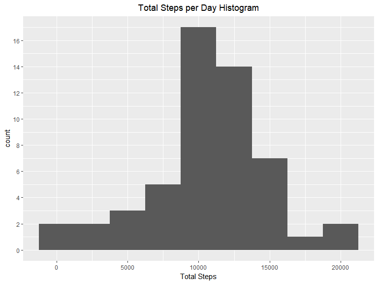
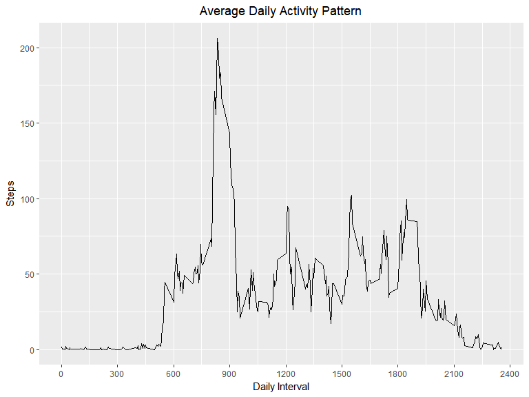
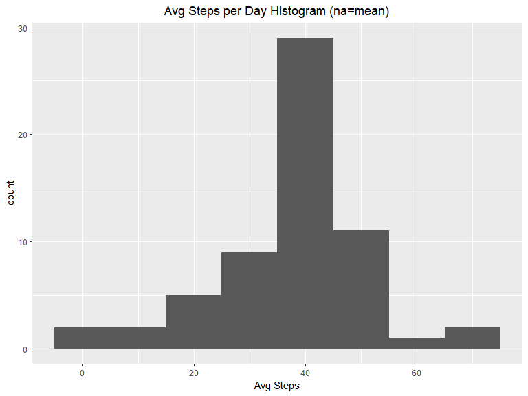
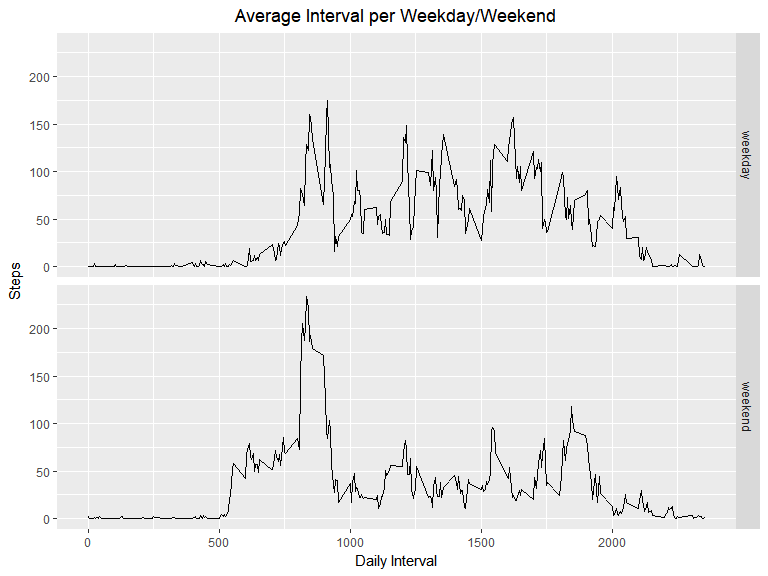

#### Load packages


##### lubridate


```r
if(!"lubridate" %in% rownames(installed.packages())){
        install.packages("lubridate")}
if(!"lubridate" %in% rownames(.packages())){
        library(lubridate)}
```

```
## Warning: package 'lubridate' was built under R version 3.3.3
```


##### dplyr


```r
if(!"dplyr" %in% rownames(installed.packages())){
        install.packages("dplyr")}
if(!"dplyr" %in% rownames(.packages())){
        library(dplyr)}
```

```
## Warning: package 'dplyr' was built under R version 3.3.3
```


##### ggplot2


```r
if(!"ggplot2" %in% rownames(installed.packages())){
        install.packages("ggplot2")}
if(!"ggplot2" %in% rownames(.packages())){
        library(ggplot2)}
```

```
## Warning: package 'ggplot2' was built under R version 3.3.3
```


## Load and Preprocess Data

###1: Load CSV from [Activity monitoring data](https://d396qusza40orc.cloudfront.net/repdata%2Fdata%2Factivity.zip)

```r
#create directory
if(!file.exists("./activitydata")){dir.create("./activitydata")}

#download data (zip)
if(!file.exists("./activitydata/activitydata.zip")){download.file("https://github.com/jcobb00/RepData_PeerAssessment1/raw/master/activity.zip",destfile = "./activitydata/activitydata.zip")}

#unzip data
if(!file.exists("./activitydata/activity.csv")){unzip("./activitydata/activitydata.zip",exdir = "./activitydata")}

#create activity data frame 
activity.data <- read.csv("./activitydata/activity.csv", header = TRUE)
```


###2: Preprocess the data

##### Format as date with lubridate


```r
activity.data$date <- ymd(activity.data$date)
```


##### Add day of week column


```r
activity.data <- cbind(activity.data,weekdays(activity.data$date))
colnames(activity.data)[4] <- "dayofweek"
```


##### Add weekday/weekend column


```r
activity.data <- cbind(activity.data,activity.data$dayofweek=='Saturday'|activity.data$dayofweek=='Sunday')
colnames(activity.data)[5] <- "weekend"
activity.data$weekend <- ifelse(activity.data$weekend == TRUE, "weekend", "weekday")
```


##### Use interval fraction to calculate ~time (interval/2355)


```r
activity.data <- cbind(activity.data,activity.data$date+(activity.data$interval/2355))
colnames(activity.data)[6] <- "date.time"
```


##### Reorder columns


```r
activity.data <- activity.data[,c(6,2,4,5,3,1)]
```


####Preprocessed data


```r
head(activity.data)
```

```
##    date.time       date dayofweek weekend interval steps
## 1 2012-10-01 2012-10-01    Monday weekday        0    NA
## 2 2012-10-01 2012-10-01    Monday weekday        5    NA
## 3 2012-10-01 2012-10-01    Monday weekday       10    NA
## 4 2012-10-01 2012-10-01    Monday weekday       15    NA
## 5 2012-10-01 2012-10-01    Monday weekday       20    NA
## 6 2012-10-01 2012-10-01    Monday weekday       25    NA
```

```r
str(activity.data)
```

```
## 'data.frame':	17568 obs. of  6 variables:
##  $ date.time: Date, format: "2012-10-01" "2012-10-01" ...
##  $ date     : Date, format: "2012-10-01" "2012-10-01" ...
##  $ dayofweek: Factor w/ 7 levels "Friday","Monday",..: 2 2 2 2 2 2 2 2 2 2 ...
##  $ weekend  : chr  "weekday" "weekday" "weekday" "weekday" ...
##  $ interval : int  0 5 10 15 20 25 30 35 40 45 ...
##  $ steps    : int  NA NA NA NA NA NA NA NA NA NA ...
```


## Daily Steps


###1: Calculate total steps taken each day


```r
total.steps.per.day <- na.omit(activity.data) %>%
        group_by(date) %>%
        summarise(totalsteps=sum(steps))
print(total.steps.per.day)
```

```
## # A tibble: 53 x 2
##          date totalsteps
##        <date>      <int>
##  1 2012-10-02        126
##  2 2012-10-03      11352
##  3 2012-10-04      12116
##  4 2012-10-05      13294
##  5 2012-10-06      15420
##  6 2012-10-07      11015
##  7 2012-10-09      12811
##  8 2012-10-10       9900
##  9 2012-10-11      10304
## 10 2012-10-12      17382
## # ... with 43 more rows
```


###2: Make a histogram of the total number of steps taken each day


```r
ggplot(data=total.steps.per.day, aes(total.steps.per.day$totalsteps)) + 
        labs(title ="Total Steps per Day Histogram") +
        theme(plot.title = element_text(hjust = 0.5)) +
        xlab("Total Steps") +
        scale_y_continuous(breaks = seq(0, 20, by = 2)) +
        scale_x_continuous(breaks = seq(0, 25000, by = 5000)) +
        geom_histogram(binwidth = 2500)
```

<!-- -->


###3: Calculate and report the mean and median total number of steps taken per day


```r
daily.mean.median <- total.steps.per.day%>%
        summarise(mean=mean(totalsteps), median=median(totalsteps))
```

```
## Warning: package 'bindrcpp' was built under R version 3.3.3
```

```r
print(daily.mean.median)
```

```
## # A tibble: 1 x 2
##       mean median
##      <dbl>  <int>
## 1 10766.19  10765
```


## Average daily activity pattern

##### (first) Calculate average steps per interval across all days


```r
interval.daily.avg <- na.omit(activity.data) %>%
        group_by(interval) %>%
        summarise(mean=mean(steps))
print(interval.daily.avg)
```

```
## # A tibble: 288 x 2
##    interval      mean
##       <int>     <dbl>
##  1        0 1.7169811
##  2        5 0.3396226
##  3       10 0.1320755
##  4       15 0.1509434
##  5       20 0.0754717
##  6       25 2.0943396
##  7       30 0.5283019
##  8       35 0.8679245
##  9       40 0.0000000
## 10       45 1.4716981
## # ... with 278 more rows
```


### 1: Plot 5-minute intervals and average steps taken across all days


```r
ggplot(data=interval.daily.avg, aes(x=interval, y=mean)) + 
        labs(title ="Average Daily Activity Pattern") +
        theme(plot.title = element_text(hjust = 0.5))+
        ylab("Steps") +
        xlab("Daily Interval") +
        scale_x_continuous(breaks = seq(from=0,to=2400,by=300)) +
        geom_line(stat="identity")
```

<!-- -->


### 2: Largest 5 minute interval averaged across all days


```r
arrange(interval.daily.avg,desc(mean))[1,]
```

```
## # A tibble: 1 x 2
##   interval     mean
##      <int>    <dbl>
## 1      835 206.1698
```


## Imputing missing values


### 1: Calculate and report the total number of missing values in the dataset


```r
as.numeric(sum(is.na(activity.data$steps)))
```

```
## [1] 2304
```

### 2: Devise a replacement plan
        All NAs occur on 8 days, use average interval for those days


```r
daily.nas <- activity.data %>%
        group_by(date) %>%
        tally(is.na(steps)) %>%
        arrange(desc(n))
daily.nas[1:8,]
```

```
## # A tibble: 8 x 2
##         date     n
##       <date> <int>
## 1 2012-10-01   288
## 2 2012-10-08   288
## 3 2012-11-01   288
## 4 2012-11-04   288
## 5 2012-11-09   288
## 6 2012-11-10   288
## 7 2012-11-14   288
## 8 2012-11-30   288
```


### 3: Set NAs to interval average


```r
mean.na <- activity.data
mean.na[is.na(activity.data)] <- mean(activity.data$steps,na.rm = TRUE)
head(mean.na)
```

```
##    date.time       date dayofweek weekend interval   steps
## 1 2012-10-01 2012-10-01    Monday weekday        0 37.3826
## 2 2012-10-01 2012-10-01    Monday weekday        5 37.3826
## 3 2012-10-01 2012-10-01    Monday weekday       10 37.3826
## 4 2012-10-01 2012-10-01    Monday weekday       15 37.3826
## 5 2012-10-01 2012-10-01    Monday weekday       20 37.3826
## 6 2012-10-01 2012-10-01    Monday weekday       25 37.3826
```


### 4(a): Plot a histogram of total steps per day (na=mean)


```r
daily.mean.median.na <- mean.na %>%
        group_by(date)%>% 
        summarise(mean=mean(steps), median=median(steps))

ggplot(data=daily.mean.median.na, aes(daily.mean.median.na$mean)) + 
        labs(title ="Avg Steps per Day Histogram (na=mean)") +
        theme(plot.title = element_text(hjust = 0.5)) +
        xlab("Avg Steps") +
        stat_bin(binwidth = 10)
```

<!-- -->

```r
        geom_histogram()
```

```
## geom_bar: na.rm = FALSE
## stat_bin: binwidth = NULL, bins = NULL, na.rm = FALSE, pad = FALSE
## position_stack
```


### 4(b): Calculate daily mean and median (na=mean)
        Mean does not change, median becomes the mean


```r
daily.mean.median.na <- mean.na %>%
        group_by(date) %>%
        summarise(totalsteps=sum(steps)) %>%
        summarise(mean=mean(totalsteps), median=median(totalsteps))
print(daily.mean.median.na)
```

```
## # A tibble: 1 x 2
##       mean   median
##      <dbl>    <dbl>
## 1 10766.19 10766.19
```


## Differences in activity patterns between weekdays and weekends

### 1: Create a new factor variable: "weekday" and "weekend" (created during preprocessing)


```r
if(!"weekend" %in% colnames(activity.data)) {
        activity.data <- cbind(activity.data,activity.data$dayofweek=='Saturday'|activity.data$dayofweek=='Sunday')
        colnames(activity.data)[5] <- "weekend"
        activity.data$weekend <- ifelse(activity.data$weekend == TRUE, "weekend", "weekday")}
```


### 2: Panel plot of interval steps averaged across all days and grouped by weekday and weekend

##### (first) Calculate average interval steps across weekdays and weekends


```r
avg.day.of.week <- na.omit(activity.data) %>%
        group_by(interval,weekend) %>%
        summarise(avgsteps=mean(steps)) %>%
        arrange(desc(weekend))
```


```r
ggplot(data=avg.day.of.week, aes(x=avg.day.of.week$interval, y=avg.day.of.week$avgsteps)) + 
        labs(title ="Average Interval per Weekday/Weekend") +
        theme(plot.title = element_text(hjust = 0.5)) +
        facet_grid(weekend ~ .) +
        ylab("Steps") +
        xlab("Daily Interval") +
        geom_line(stat="identity")
```

<!-- -->


